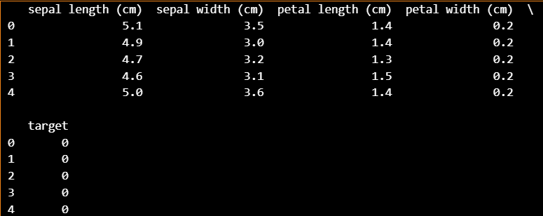
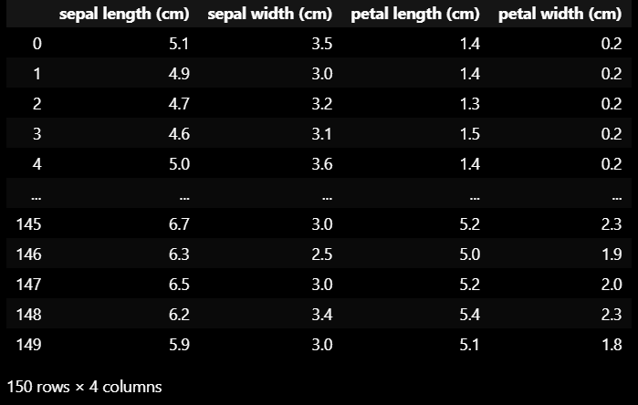
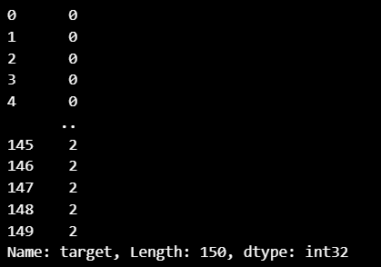
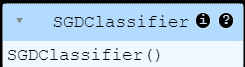
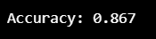
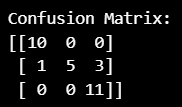
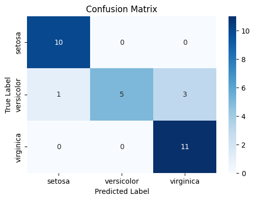

# SGD-Classifier
## AIM:
To write a program to predict the type of species of the Iris flower using the SGD Classifier.

## Equipments Required:
1. Hardware – PCs
2. Anaconda – Python 3.7 Installation / Jupyter notebook

## Algorithm

1. Load Data: Load the Iris dataset using load_iris() and create a pandas DataFrame with the feature names and target variable.
2. Prepare Features and Target: Split the DataFrame into features (X) and target (y) by dropping the target column from X.
3. Split Data: Use train_test_split to divide the dataset into training and testing sets with a test size of 20%.
4. Train Model: Initialize and fit a Stochastic Gradient Descent (SGD) classifier on the training data.
5. Evaluate Model: Predict the target values for the test set, calculate accuracy, and print the confusion matrix to assess the model's performance.

## Program:
```
/*
Program to implement the prediction of iris species using SGD Classifier.
Developed by: Bharath Raj P
RegisterNumber: 212223230031 
*/
import pandas as pd 
from sklearn.datasets import load_iris 
from sklearn.linear_model import SGDClassifier
from sklearn.model_selection import train_test_split 
from sklearn.metrics import accuracy_score, confusion_matrix 
import matplotlib.pyplot as plt 
import seaborn as sns 
iris=load_iris() 
df=pd.DataFrame(data=iris.data, columns=iris.feature_names) 
df['target']=iris.target 
print(df.head()) 
X = df.drop('target',axis=1) 
X
y=df['target']
y
X_train, X_test, y_train, y_test = train_test_split(X, y, test_size=0.2, random_state=42 )
sgd_clf=SGDClassifier(max_iter=1000, tol=1e-3)
sgd_clf.fit(X_train,y_train)
y_pred=sgd_clf.predict(X_test) 
accuracy=accuracy_score(y_test,y_pred)
print(f"Accuracy: {accuracy:.3f}") 
cm=confusion_matrix(y_test,y_pred) 
print("Confusion Matrix:") 
print(cm)
plt.figure(figsize=(6,4))
sns.heatmap(cm, annot=True, cmap="Blues", fmt='d', xticklabels=iris.target_names, yticklabels=iris.target_names)
plt.xlabel("Predicted Label")
plt.ylabel("True Label")
plt.title("Confusion Matrix")
plt.show()
```
## Output:
 
## Dataset :


## X and Y values :



## Model:


## Accuracy:


## Matrix:


## Confusion Matrix:


## Result:
Thus, the program to implement the prediction of the Iris species using SGD Classifier is written and verified using Python programming.
